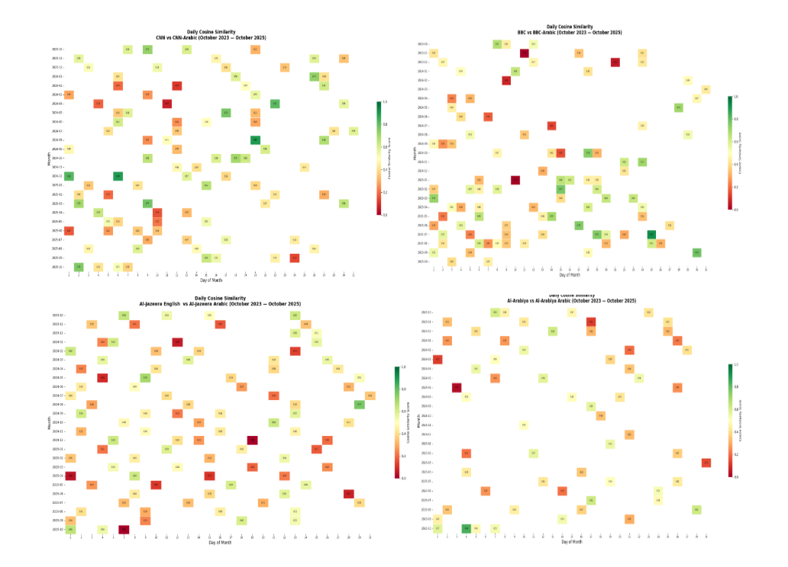
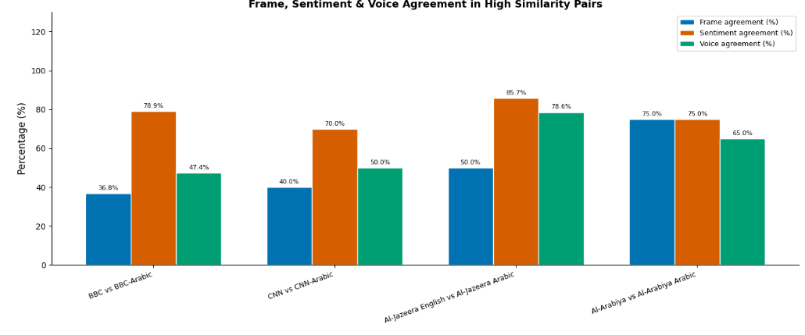

# Bilingual News Headline Analysis
### English & Arabic Frame, Sentiment, Voice & Semantic Similarity

> A bilingual NLP pipeline investigating how English and Arabic editions of the same news agency cover the same stories — comparing framing, sentiment, grammatical voice, and semantic alignment across eight major outlets.

---

##  Research Questions

- Do English and Arabic editions of the same agency use different **narrative frames**?
- Does **sentiment** differ across languages for the same stories?
- Are **active/passive voice** patterns different between languages?
- How **semantically similar** are bilingual outputs from the same agency?

---

## Dataset

| Column | Description |
|---|---|
| `id` | Unique headline identifier |
| `date` | Publication date (`DD/MM/YYYY`) |
| `source` | News outlet name |
| `language` | `English` or `Arabic` |
| `headline` | Raw headline text |
| `frame` | Narrative frame assigned to the headline |

**Outlets covered:**

| English | Arabic |
|---|---|
| BBC | BBC-Arabic |
| CNN | CNN-Arabic |
| Al-Jazeera English | Al-Jazeera Arabic |
| Al-Arabiya | Al-Arabiya Arabic |

 Dataset available on [Kaggle](https://www.kaggle.com/datasets/romaisaahussein/newsdataset)

---

##  Analysis Pipeline

| Step | What it does |
|---|---|
| 1. Text Cleaning | Separate pipelines for English and Arabic (diacritics, stopwords, punctuation) |
| 2. Word Frequency | Top words per outlet with bilingual word clouds |
| 3. Frame Analysis | Distribution of narrative frames overall, per language, and per agency |
| 4. Sentiment Analysis | Positive / Neutral / Negative classification per source and language |
| 5. Voice Detection | Active vs Passive voice using spaCy (English) and Stanza (Arabic) |
| 6. Semantic Similarity | Daily and monthly cosine similarity between each agency's EN and AR output |
| 7. Keyword Analysis | Frame, sentiment, voice, and similarity breakdown per keyword |
| 8. High-Similarity Pairs | Headline pairs above a similarity threshold compared across frame, sentiment, voice |

---

##  Tech Stack

| Category | Tools |
|---|---|
| Data handling | `pandas`, `numpy` |
| NLP — English | `spaCy` (`en_core_web_sm`) |
| NLP — Arabic | `stanza` (Arabic pipeline) |
| Sentiment model | `cardiffnlp/twitter-xlm-roberta-base-sentiment` |
| Similarity model | `paraphrase-multilingual-MiniLM-L12-v2` |
| Arabic display | `arabic-reshaper`, `python-bidi` |
| Visualisation | `matplotlib`, `seaborn`, `wordcloud` |
| Progress tracking | `tqdm` |
| Export | `openpyxl` (Excel) |

---

##  Installation

```bash
pip install spacy stanza arabic-reshaper python-bidi wordcloud \
            sentence-transformers transformers torch tqdm --quiet

python -m spacy download en_core_web_sm
```

Then download Stanza models (first run only):

```python
import stanza
stanza.download("en")
stanza.download("ar")
```

---


##  Outputs

| File | Description |
|---|---|
| `wordcloud_*.png` | Word clouds per outlet and language |
| `frame_distribution.*` | Overall frame counts and percentages |
| `frames_per_language.*` | Frame breakdown by language |
| `frames_BBC/CNN/...` | EN vs AR frame comparison per agency |
| `sentiment_grouped_*.png` | Sentiment distribution by source and language |
| `sentiment_per_frame_*.png` | Sentiment heatmaps per language |
| `active_passive_*.png` | Voice distribution chart |
| `similarity_heatmap_monthly.png` | Monthly cosine similarity per agency pair |
| `*_daily_similarity_heatmap.png` | Daily similarity calendars per agency |
| `daily_similarity_all_agencies.xlsx` | All daily similarity scores |
| `keyword_analysis_clean.xlsx` | Keyword-level breakdown |
| `high_similarity_pairs.xlsx` | Top similar headline pairs per agency |

---
## Screenshots


*Monthly cosine similarity between English and Arabic outputs per agency*


*Frame, sentiment and voice agreement in high similarity headline pairs*

---
##  Author

[Romaisaa Ahmed] — University Project

---

## License

This project is licensed under the [MIT License](LICENSE).
